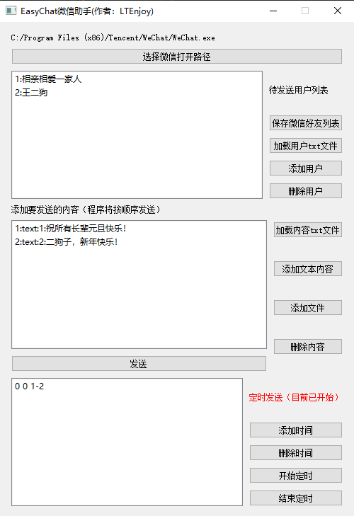
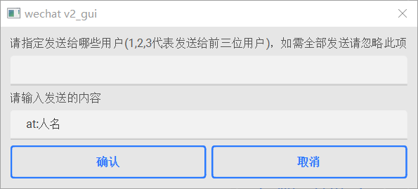

# easyChat

PC端微信助手（非web微信版）：定时发送信息；群发信息；自动回复等。

最新编辑日期：2022/07/27

有疑问推荐在Issues上提出以供他人参考。

个人邮箱：[sujinltenjoy@gmail.com](mailto:sujinltenjoy@gmail.com)。

如果有帮到您的话，麻烦顺手点个star~

## 更新日志

2022/07/07	完成发送内容的优化，现在支持一次定时按顺序发送多条信息。

2022/07/27	完成发送内容的优化，现在支持微信群@他人的操作。

2022/09/16	新增获取窗口聊天记录的功能（仅支持代码调用）。

## 前言

之前使用过的itchat等工具都是基于web版网页微信的。自从网页微信无法登陆之后，之前的工具都失效了。因此，本人采用uiaumation对微信进行~~暴力~~操作，就有了本仓库。并且用~~自学了三年的图形界面水平~~写了个简易ui供大家使用。

## 支持功能

### 图形界面方式：

- 群发消息
- 定时发送消息
- 自动回复（随缘开发ing）

> 注意事项：请在使用过程中严格遵守输入格式，否则程序会自动退出。（要去考虑一个个边界条件太麻烦了，我直接采取一个鸵鸟政策）。

### 代码调用方式：

- 在指定群聊中@他人（若@所有人需具备@所有人权限）-> def at()

- 搜索指定用户名的联系人发送信息 -> def send_msg()

- 搜索指定用户名的联系人发送文件 -> def send_file()

- 获取所有通讯录中所有联系人 -> def find_all_contacts()

- 获取指定聊天窗口的聊天记录 -> def get_dialogs()

> 注意事项：请进入**ui_auto_wechat.py**文件内部进行调用。内部代码简易注释详尽，可以自由尝试。

## 文件说明

**ui_auto_wechat.py**是对PC版微信进行的各种操作实现代码。内部代码简易，支持自由DIY。

**wechat_gui.py**是编写的图形界面，在图形界面中调用对微信的操作。由于本人太懒，直接放弃美工，后期边做边改吧。

**wechat_gui.exe**是打包好的exe程序，可以直接下载进行使用。也可以对**wechat_gui.py**进行打包生成exe文件。

## 图形界面

			**图形界面示意图**

## 使用步骤

#### 基础操作

1. 点击“选择微信打开路径”，在目录下选择微信的可执行exe文件。

2. 点击“添加用户”，输入要发送信息的用户名（在搜索框第一个展示的名字，如下所示）。

   

3. 点击文本框右侧的添加按钮，选择添加文本或文件。添加的内容会在发送时按添加的顺序一次发送。

4. （可选）如果要进行定时发送，点击下方的“添加时间”按钮，按照规定的格式添加时间。随后点击“开始定时”，当时间达到列表中的指定时间时，便会将指定的消息发送给所有的指定用户。

#### 微信群@他人

1. 提前查看微信群里要@的人的名字

   

2. 在界面中添加文本内容，格式为“at: + 人名”（如果@所有人则不需要填写人名，注意冒号为英文符号）

   

> 注意：@所有人时请确保拥有微信群@所有人的权限，否则将失败。目前不支持直接在@人名后发送内容，请先@人名，随后单独添加发送内容。
