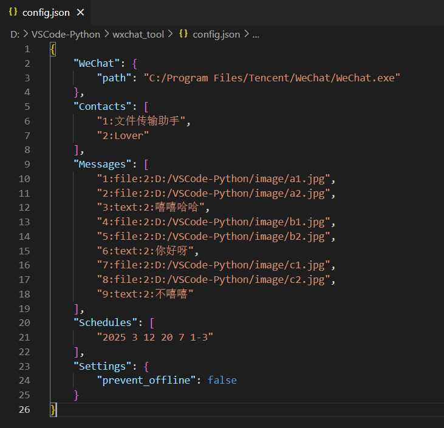

# EasyChat

PC端微信助手（非web微信版）：定时发送信息；群发信息；自动回复等。直接下载文件目录内的exe即可使用。

最新编辑日期：2025/02/14

有疑问推荐在 Issues 上提出以供他人参考。

个人邮箱：[sujinltenjoy@gmail.com](mailto:sujinltenjoy@gmail.com)

如果有帮到您的话，麻烦顺手点个star~

## 路线图

- 暂无。

## 更新日志

详见 [CHANGELOG.md](./CHANGELOG.md)

## 前言

之前使用过的itchat等工具都是基于web版网页微信的。自从网页微信无法登陆之后，之前的工具都失效了。因此，本人采用[uiautomation](https://github.com/yinkaisheng/Python-UIAutomation-for-Windows)对微信进行~~暴力~~操作，就有了本仓库。并且用~~自学了三年的图形界面水平~~写了个简易ui供大家使用。

> [!TIP]
> 请确保输入相应内容时严格按照示例的内容格式进行，以保证代码的正确执行。

## 支持功能

### 图形界面方式：

- 群发消息
- 定时发送消息
- 自动回复（参考 https://github.com/LTEnjoy/easyChat/issues/33 ）

> [!TIP]
> 请在使用过程中严格遵守输入格式，否则程序会自动退出。（要去考虑一个个边界条件太麻烦了，我直接采取一个鸵鸟政策）。

### 代码调用方式：

- 在指定群聊中@他人（若@所有人需具备@所有人权限）-> def at()

- 搜索指定用户名的联系人发送信息 -> def send_msg()

- 搜索指定用户名的联系人发送文件 -> def send_file()

- 获取所有通讯录中所有联系人 -> def find_all_contacts()

- 自动检测新消息 -> def check_new_msg()

- 设置自动回复的联系人列表 -> def set_auto_reply()

- 获取指定聊天窗口的聊天记录 -> def get_dialogs()

- 获取指定聊天窗口的图片和视频 -> def save_dialog_pictures()

> [!TIP]
> 请进入**ui_auto_wechat.py**文件内部进行调用。内部代码简易注释详尽，可以自由尝试。

## 文件说明

###### **pack.py**
打包函数，用户直接运行``python pack.py``即可打包exe文件。

###### **automation.py**
可视化控件树的文件，针对希望DIY的用户，方便进行控件类型和深度的查看。

###### **clipboard.py**
提供了对文件的复制操作，调用函数即可将指定路径的文件复制到剪切板。

###### **ui_auto_wechat.py**
是对PC端微信进行的各种操作实现代码。内部代码简易，支持自由DIY。

###### **wechat_locale.py**
提供了对微信多种语言的支持，可以根据自己的需要进行选择。

###### **wechat_gui.py**
是编写的图形界面，在图形界面中调用对微信的操作。由于本人太懒，直接放弃美工，后期边做边改吧。

###### **module.py**

控件模块，组成UI界面的小组件。

###### **wechat_gui.exe**
是打包好的exe程序，可以直接下载进行使用。也可以对**wechat_gui.py**进行打包生成exe文件。

## 图形界面


> 图形界面示意图

## 使用步骤

### 基础操作

1. 点击“选择微信打开路径”，在目录下选择微信的可执行exe文件。

2. 点击“添加用户”，输入要发送信息的用户名（在搜索框第一个展示的名字，如下所示）。

   

3. 点击文本框右侧的添加按钮，选择添加文本或文件。添加的内容会在发送时按添加的顺序一次发送。

4. （可选）如果要进行定时发送，点击下方的“添加时间”按钮，按照规定的格式添加时间。随后点击“开始定时”，当时间达到列表中的指定时间时，便会将指定的消息发送给指定的用户。

### 配置文件

配置文件为 json 格式，在根目录下有一个config.json文件，里面有配置项。



> [!TIP]
> 直接点击“写入配置”可以生成 config.json 文件

### 微信群@他人

1. 提前查看微信群里要@的人的名字

   

2. 在界面中添加文本内容，格式为“at: + 人名”（如果@所有人则不需要填写人名，注意冒号为英文符号）

   

> 注意：@所有人时请确保拥有微信群@所有人的权限，否则将失败。目前不支持直接在@人名后发送内容，请先@人名，随后单独添加发送内容。

### 加联系人数据

联系人既包括个人、也包括群聊。

用户可以提前查看所有要发送的联系人的名字，并存储在json配置文件中，之后点击“从配置加载”按钮即可。

在 config.json 文件中，Contacts 是一个列表，每一项都是一个联系人：

```json
    "Contacts": [
        "1:文件传输助手",
        "2:Lover"
    ],
```

> 格式为：
> 联系人ID序列:联系人名字

每一行都是一个联系人的名字。

### 加内容数据

你可以提前写下要发送的内容，并存储在json配置文件中，之后点击“从配置加载”按钮即可。

如果在一条内容中想要进行换行，可以在内容中使用“\n”进行换行，例如：“你好\n我是xx”。

在 config.json 文件中，Messages 是一个列表，每一项都是一条消息：
```json
    "Messages": [
        "1:file:2:D:/VSCode-Python/image/a1.jpg",
        "2:file:2:D:/VSCode-Python/image/a2.jpg",
        "3:text:2:嘻嘻哈哈",
        "4:file:2:D:/VSCode-Python/image/b1.jpg",
        "5:file:2:D:/VSCode-Python/image/b2.jpg",
        "6:text:2:你好呀",
        "7:file:2:D:/VSCode-Python/image/c1.jpg",
        "8:file:2:D:/VSCode-Python/image/c2.jpg",
        "9:text:2:不嘻嘻"
    ],
```

> 格式为：
> 内容ID序列:类型:联系人ID序列:内容/文件路径

在输入 **内容** 之前，你需要先指定该条消息要发送给哪些联系人：

- 如果默认发送给所有联系人，则输入all:，然后写上要发送的内容
- 如果要发送给指定的联系人，则输入用户的编号，多个联系人ID序列之间用英文逗号分隔（如1,2,3），然后写上要发送的内容

> [!TIP]
> 指定对象与发送内容之间要用英文冒号进行分隔

## 对开发者

项目开发语言：[Python 3.12](https://www.python.org/downloads/release/python-3129/)

创建、进入 venv 隔离环境，避免污染全局库

```powershell
# 创建
python3 -m venv venv
# 进入
.\venv\Scripts\activate
```

安装依赖

```powershell
pip install -r requirements.txt
```

推荐使用 [Trae AI](https://www.trae.ai/zh) 赋能开发。

一键打包命令：
```powershell
python pack.py
```

## 友情赞助

如果你觉得这款应用不错的话，麻烦顺手点个star。也可以请作者喝杯奶茶，让我在日常生活中感受到一些小确幸~

<table>
<tr>
<td></td>
<td></td>
</tr>
</table>